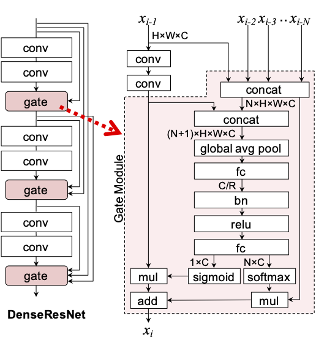

# What is DenseResNet ?

[](res/architecture.png)

DenseResNet is a Densely connected Residual convolutional neural Network for image recognition tasks.
Though an architecture of DenseResNets is a stack of Residual Blocks just like ResNets, the circuit design is similar to DenseNets.
In order to improve the performance, DenseResNets use Gate Modules instead of elemet-wise additions or concatenations.
Gate Modules contain attention mechanisms which select useful features dynamically.
Experiental results show that DenseResNets achieve higher performance than conventional ResNets in image classification tasks.

［NOTE］This implementation concains some unefficient codes because the purpuse is performance evalutation of DenseResNets.
<div class="clearfix"></div>

DenseResNets are published in a following paper:
1. Atsushi Takeda. "Dense Residual Networks for Image Classification." The 23rd Meeting on Image Recognition and Understanding (MIRU2020), 2020 (in Japanese).

# How to use
## Dataset preparation
### [ImageNet]
1. Download following files from ImageNet web site.
    - ILSVRC2012_devkit_t12.tar.gz
    - ILSVRC2012_img_train.tar
    - ILSVRC2012_img_val.tar
2. Save these files in `data/imagenet`.
    ```
    % tree data
    data
    └── imagenet
        ├── ILSVRC2012_devkit_t12.tar.gz
        ├── ILSVRC2012_img_train.tar
        ├── ILSVRC2012_img_val.tar
        └── readme.txt
    ```
3. Run a preparation script: `src/prepare.py`.
    ```
    % python src/prepare.py imagenet
    ```

### [TinyImagenet]
1. Download a following file from [https://tiny-imagenet.herokuapp.com/](https://tiny-imagenet.herokuapp.com/).
    - tiny-imagenet-200.zip
2. Save these files in `data/tinyimagenet`.
    ```
    % tree data
    data
    └── tinyimagenet
        ├── readme.txt
        └── tiny-imagenet-200.zip
    ```
3. Run a preparation script: `src/prepare.py`.
    ```
    % python src/prepare.py tinyimagenet
    ```

## Training
1. Create a model file.
    A model file must be created before training. A following command creates a initialized model file.
    ```
    % python src/create.py [file name] [dataset name] [model name] --config [config file]
    ```
    For example, a following command creates a model file of ResNet-110 for CIFAR-100.
    ```
    % python src/create.py model.pth cifar100 resnet-110 --config config/cifar/resnet-110.txt
    ```
2. Train the model.
    A following command train the model.
    ```
    % python src/train.py [file name] --gpu [GPU ID]
    ```

## Informations
- `src/model.py` shows a list of supported models.
    ```
    % python src/model.py [dataset name]
    ```
- `src/view.py` shows the details of the model file.
    ```
    % python src/view.py [file name]
    ```
- `src/flops.py` shows the required FLOPs of the model.
    ```
    % python src/flops.py [file name]
    ```

# Performances
[NOTE] Settings of following evaluations might be different from reported ones in original papers.
## Image Classification
### CIFAR-100
|Model|# of params|flops|top-1 acc.|settings|
|---:|:---:|:---:|:---:|:---|
|resnet-110<br>dense-resnet-110|1.74M<br>2.23M|258M<br>264M|79.03%<br>80.34%|[resnet-110.txt](config/cifar/resnet-110.txt)|

### CIFAR-10
|Model|# of params|flops|top-1 acc.|settings|
|---:|:---:|:---:|:---:|:---|
|resnet-110<br>dense-resnet-110|1.74M<br>2.23M|258M<br>264M|96.40%<br>96.59%|[resnet-110.txt](config/cifar/resnet-110.txt)|

