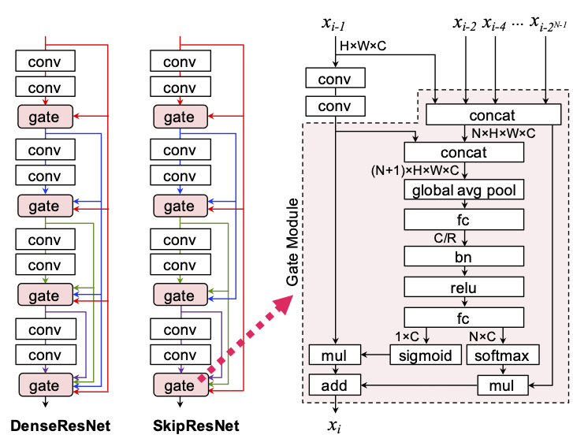

# What is Skip-ResNet ?

[](res/architecture.png)

Skip-ResNet is a Skip connected Residual convolutional neural Network for image recognition tasks.
Though an architecture of Skip-ResNets is a stack of Residual Blocks just like ResNets, each residual block has several inbounds from the previous blocks in same manner as DenseNets.
In order to improve the performance, a residual block in Skip-ResNets includes a Gate Module instead of elemet-wise additions in ResNets or concatenations in DenseNets.
A Gate Module contains an attention mechanism which selects useful features dynamically.
Experimental results show that an architecture of Skip-ResNets improves the performance in image classification tasks.

# What is Dense-ResNet ?

Dense-ResNet is a Densely connected Residual convolutional neural Network for image recognition tasks.
An architecture of Dense-ResNets is similar to Skip-ResNets, but the shortcut design is different.

<div class="clearfix"></div>

DenseResNets are published in a following paper:
1. Atsushi Takeda. "画像分類のためのDense Residual Networkの提案 (Dense Residual Networks for Image Classification)." The 23rd Meeting on Image Recognition and Understanding (MIRU2020), 2020 (in Japanese).

# How to use
## Dataset preparation
### [ImageNet]
1. Download following files from ImageNet web site.
    - ILSVRC2012_devkit_t12.tar.gz
    - ILSVRC2012_img_train.tar
    - ILSVRC2012_img_val.tar
2. Save these files in `data/imagenet`.
    ```
    % tree data
    data
    └── imagenet
        ├── ILSVRC2012_devkit_t12.tar.gz
        ├── ILSVRC2012_img_train.tar
        ├── ILSVRC2012_img_val.tar
        └── readme.txt
    ```
3. Run a preparation script: `src/prepare.py`.
    ```
    % python src/prepare.py imagenet
    ```

## Training
1. Create a model file.
    A model file must be created before training. A following command creates a initialized model file.
    ```
    % python src/create.py [file name] [dataset name] [model name] --config [config file]
    ```
    For example, a following command creates a model file of ResNet-110 for CIFAR-100.
    ```
    % python src/create.py model.pth cifar100 ResNet-110 --config config/cifar/ResNet-110.txt
    ```
2. Train the model.
    A following command trains the model.
    ```
    % python src/train.py [file name] --gpu [GPU ID]
    ```

## Informations
- `src/model.py` shows a list of supported models.
    ```
    % python src/model.py [dataset name]
    ```
- `src/view.py` shows the details of the model file.
    ```
    % python src/view.py [file name]
    ```
- `src/flops.py` shows the required FLOPs of the model.
    ```
    % python src/flops.py [file name]
    ```

<!--
# Performances
## Image Classification
### ImageNet-1k
|Model|# params|flops|top-1 acc.|settings|
|---:|:---:|:---:|:---:|:---|
|MobileNetV2-1.0<br>Dense-MobileNetV2-1.0|3.50M<br>4.08M|315M<br>322M|72.66%<br>73.69%|[mobilenetv2-1.0.txt](config/imagenet/mobilenetv2-1.0.txt)|
|MobileNetV3-Large<br>Dense-MobileNetV3-Large|5.48M<br>5.85M|236M<br>242M|74.14%<br>74.42%|[mobilenetv3-large.txt](config/imagenet/mobilenetv3-large.txt)|

### CIFAR-100
|Model|# params|flops|top-1 acc.|settings|
|---:|:---:|:---:|:---:|:---|
|ResNet-110<br>Dense-ResNet-110|1.74M<br>2.23M|258M<br>264M|79.03%<br>80.34%|[resnet-110.txt](config/cifar/resnet-110.txt)|

### CIFAR-10
|Model|# params|flops|top-1 acc.|settings|
|---:|:---:|:---:|:---:|:---|
|ResNet-110<br>Dense-ResNet-110|1.74M<br>2.23M|258M<br>264M|96.40%<br>96.59%|[resnet-110.txt](config/cifar/resnet-110.txt)|
-->
